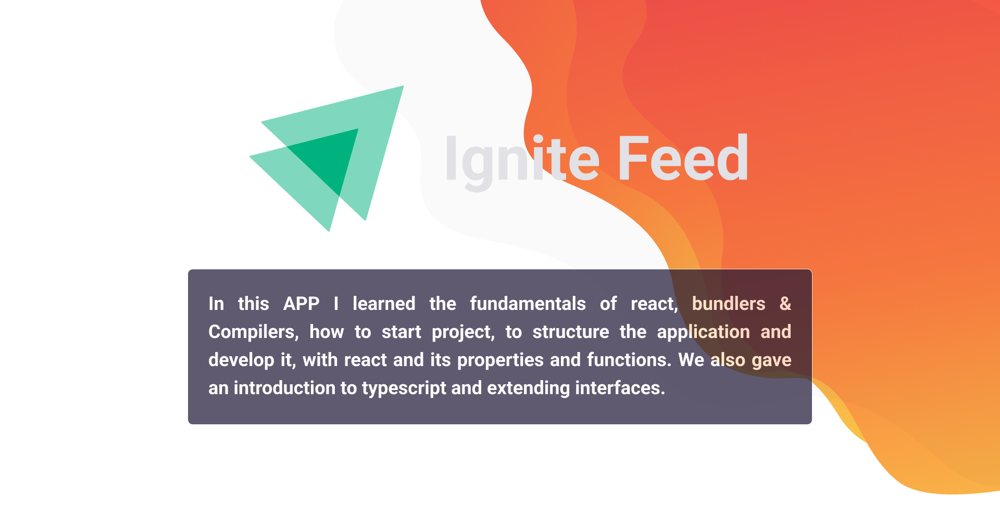
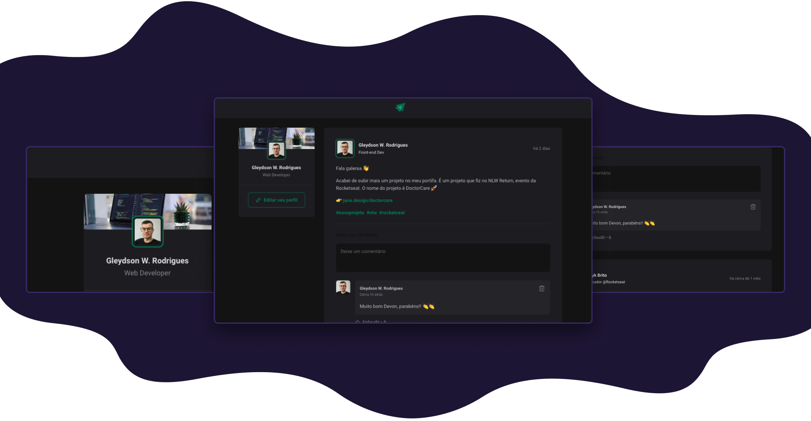

<br/><br/>

<h2 align="center">🧭 Roadmap</h2>
<hr/>
<br/>

### 🖥 Step 01

<br/>

<p>Starting with React, fundaments, bundlers & Compilers, components and properties.</p>

<br/>

### 🖥 Step 02

<br/>

<p>Structuring the app folder and components. Working with figma. Developing the app.</p>

<br/>

### 🖥 Step 03

<br/>

<p>Iterating with JSX. Piping props and functions. Making app functional.</p>

<br/>

### 🖥 Step 04

<br/>

<p>Fundaments of React. Converting app to Typescript. Extending React interfaces.</p>

<br/><br/>

<h2 align="center">🛠 Installation</h2>
<hr/>
<br/>

You can use [git](https://git-scm.com) or a tool like [degit](https://github.com/Rich-Harris/degit) to clone my projects for your directory.

```sh
#clone project repository
git clone HTTTPS-or-SSH-URL
#OR
npx degit gw-rodrigues/repository-name new-project-folder-name

#go to project folder
cd new-project-folder-name

#install dependencies
npm install
#OR
yarn

#start project developer mode
npm run dev
#OR
yarn dev
```

Open [http://localhost:3000](http://localhost:3000) with your browser to see the result.

<br/><br/>

<h2 align="center">🔬 More</h2>
<hr/>
<br/>

[](./LICENSE)


